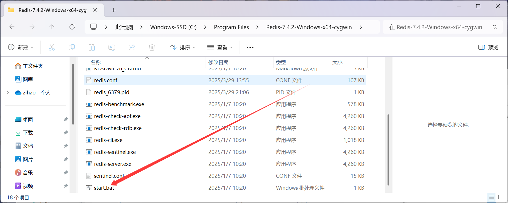
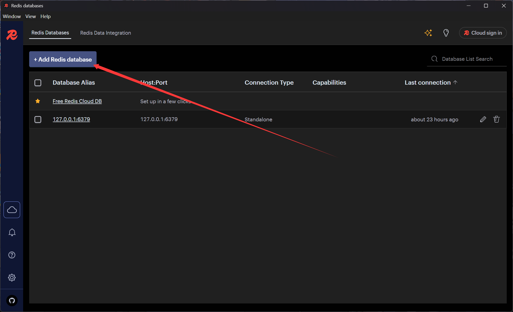
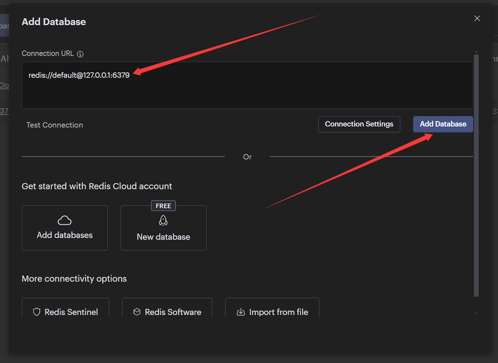
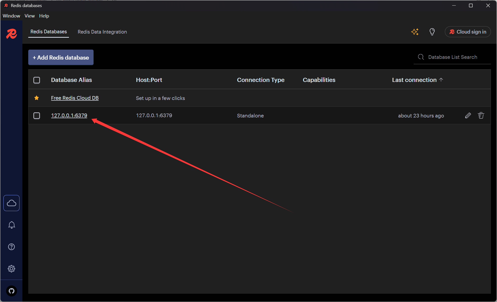
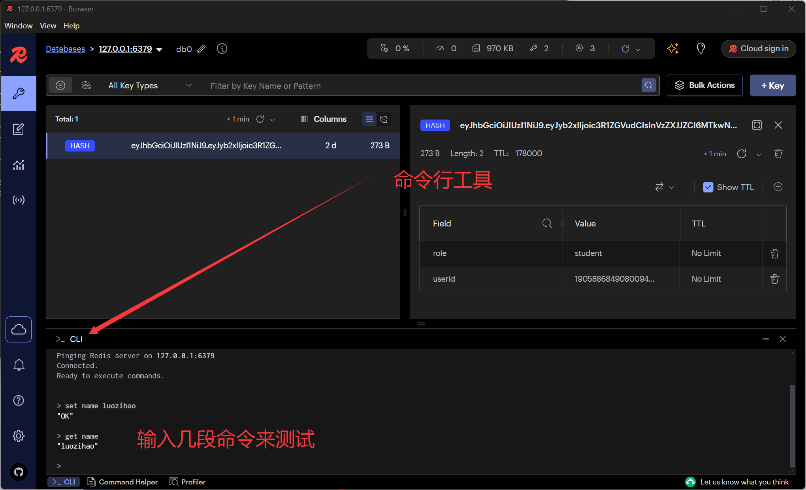

---
tags:
  - redis
  - springboot
date: 2025/4/16
cover:
---
## 1 安装 `redis`​

Windows有以下三种方式来安装

* wsl 来虚拟一个ubuntu来运行redis
* 使用docker来安装
* 使用Windows安装文件来安装

[Redis Windows 安装文件地址](https://github.com/redis-windows/redis-windows/releases/tag/7.4.2)

> 推荐使用第三种来安装，快速间接，但问题就是需要自行需`github`​寻找`redis`​，因为官方不提供Windows版本

## 2 安装`Redis Insight`​

​`Redis Insight`​是一个远程连接`redis`​的图形化工具

[下载链接](https://redis.io/insight/)

## 3 简单配置

1. 解压`Windows安装文件来安装`​
    点击启动`redis`​
    
2. 启动`Redis Insight`​
    我们点击 `add redis database`​
    来添加一个数据库
    
3. 输入本机ip地址和`redis`​端口号（一般是默认的）
    

4. 我们点击刚刚添加好的数据库

    

5. 测试一下我们添加的数据库

    可以看到这里已经测试成功了，我们的redis已经成功安装完成了！
## 4 在`springboot`​中使用`redis`​
### 4.1 导入mapper坐标
[Redis Maven坐标地址](https://mvnrepository.com/artifact/org.springframework.boot/spring-boot-starter-data-redis)
```bash
<dependency>
            <groupId>org.springframework.boot</groupId>
            <artifactId>spring-boot-starter-data-redis</artifactId>
</dependency>
```

然后需要